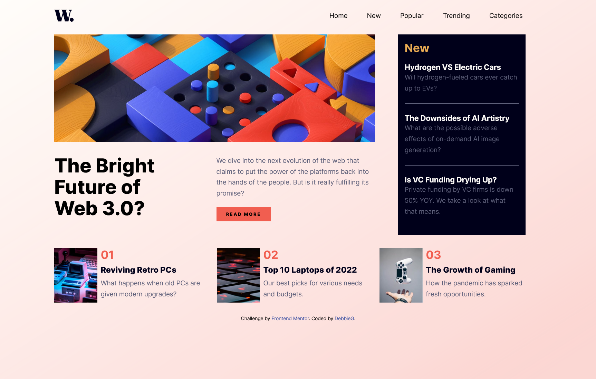

# Frontend Mentor - News homepage solution

This is a solution to the [News homepage challenge on Frontend Mentor](https://www.frontendmentor.io/challenges/news-homepage-H6SWTa1MFl). Frontend Mentor challenges help you improve your coding skills by building realistic projects.

## Table of contents

- [Overview](#overview)
  - [The challenge](#the-challenge)
  - [Screenshot](#screenshot)
  - [Links](#links)
- [My process](#my-process)
  - [Built with](#built-with)
  - [What I learned](#what-i-learned)
  - [Continued development](#continued-development)
  - [Useful resources](#useful-resources)
- [Author](#author)
- [Acknowledgments](#acknowledgments)

**Note: Delete this note and update the table of contents based on what sections you keep.**

## Overview

It was time to get a better understanding of grid and flex. The "News homepage" was a real challenge regarding that. But in the end I got much more out of it.

### The challenge

For me the most challenging were the nested grids. I found a good solution using '@container queries' beside '@media queries'. This is especially helpful if not the layout but only a specific container has to change.

### Screenshot

### Links

- Solution URL: [Add solution URL here](https://your-solution-url.com)
- Live Site URL: [Add live site URL here](https://your-live-site-url.com)

## My process

### Built with

- Semantic HTML5 markup
- CSS custom properties
- Flexbox
- CSS Grid
- Mobile-first workflow

### What I learned

- I improved my workflow by building the layout first. When this was working, only then I started to add the content.
- I finally started to understand clamp() and its power, especially to handle font sizing.
- For so long @container queries were a black box for me, but here I practised it for the first time.

### Continued development

Use this section to outline areas that you want to continue focusing on in future projects. These could be concepts you're still not completely comfortable with or techniques you found useful that you want to refine and perfect.

**Note: Delete this note and the content within this section and replace with your own plans for continued development.**

### Useful resources

This video helped me a lot to understand @container queries: https://www.youtube.com/watch?v=ypN-Uwshc5M.

## Author

- Frontend Mentor - [@DvoraG](https://www.frontendmentor.io/profile/DvoraG)

## Acknowledgments

Thanks to Jack Harrington for his YouTube video on @container queries!
